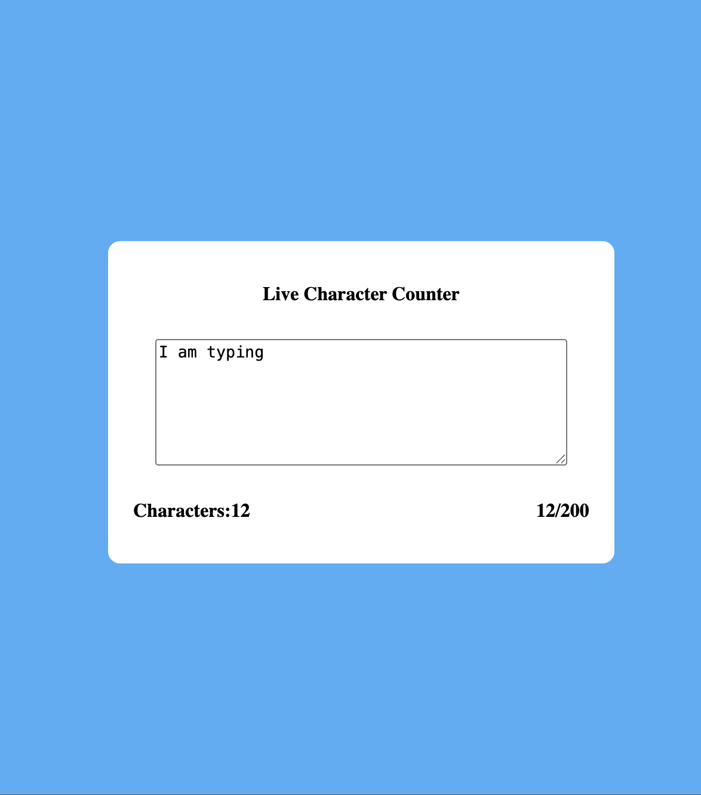

# 📝 Live Character Counter

A simple Live Character Counter built using **HTML, CSS, and JavaScript**. The application updates the character count in real time as the user types and provides visual feedback when the character count exceeds a specified limit.

## 🚀 Features

- Live character counting while typing
- Maximum input limit of **200 characters**
- Character count updates instantly
- Character count turns **red** after **180 characters**
- Responsive and clean UI
- Built using Vanilla JavaScript (No libraries or frameworks)

---

## 🛠️ Technologies Used

- HTML5
- CSS3 (Flexbox)
- JavaScript (DOM Manipulation & Events)

---

## 📚 Concepts Practiced

### HTML
- Semantic page structure
- `<textarea>`
- `maxlength` attribute
- IDs and Classes

### CSS
- Flexbox
- Centering elements
- Responsive sizing
- Border radius
- Colors
- Layout using parent-child relationships

### JavaScript
- DOM Selection (`getElementById`)
- Event Listeners
- `input` Event
- Reading textarea value
- String `.length`
- Updating DOM using `textContent`
- Conditional statements (`if / else`)
- Dynamic CSS using `element.style.color`

---

## 🧠 How It Works

1. User types inside the textarea.
2. The `input` event fires on every keystroke.
3. JavaScript calculates the current character count using:

```javascript
textarea.value.length
```

4. The count is displayed on the screen.
5. If the count exceeds **180**, the counter text turns **red**.
6. Input is restricted to **200 characters** using the `maxlength` attribute.

---

## 📁 Project Structure

```
Live-Character-Counter/
│
├── index.html
├── style.css
├── script.js
└── README.md
```

---

## 📸 Screenshot



## 🎯 Learning Outcome

This project helped me understand:

- Event-driven programming
- DOM manipulation
- Dynamic UI updates
- Real-time input handling
- Flexbox layouts
- Parent-child layout thinking
- JavaScript state derived from user input

---


## 👨‍💻 Author

**Agarsha**

Frontend Practice Project - Task 2
