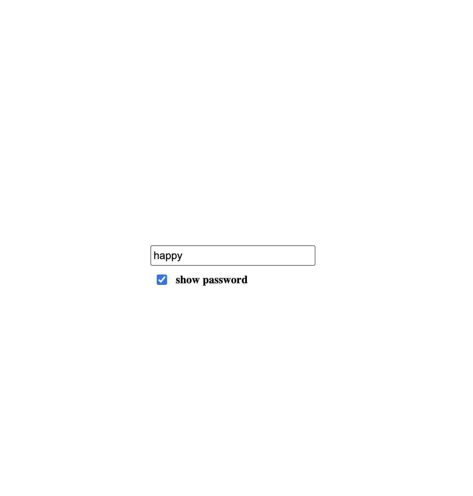

# 🔐 Password Show/Hide

A simple Password Show/Hide application built using **HTML, CSS, and JavaScript**. The application allows users to toggle password visibility using a checkbox, improving usability while maintaining a clean interface.

---

## 🚀 Features

- Password input field
- Password hidden by default
- Show Password checkbox
- Toggle between hidden and visible password
- Clean and responsive UI
- Built using Vanilla JavaScript (No frameworks)

---

## 🛠️ Technologies Used

- HTML5
- CSS3 (Flexbox)
- JavaScript (DOM Manipulation & Events)

---

## 📚 Concepts Practiced

### HTML
- `<input type="password">`
- `<input type="checkbox">`
- `placeholder`
- `label`
- IDs and Classes

### CSS
- Flexbox
- Vertical layout
- Horizontal alignment
- Spacing using `gap`
- Basic typography

### JavaScript
- DOM Selection (`getElementById`)
- Event Listeners
- Checkbox `checked` property
- Conditional Statements (`if / else`)
- Manipulating HTML attributes
- Updating Input `type`

---

## 🧠 How It Works

1. Password is hidden by default using:

```html
type="password"
```

2. When the user checks the **Show Password** checkbox:

- JavaScript detects the checkbox state using:

```javascript
checkbox.checked
```

3. If checked:

```javascript
password.type = "text";
```

The password becomes visible.

4. If unchecked:

```javascript
password.type = "password";
```

The password is hidden again.

---

## 📁 Project Structure

```
Password-Show-Hide/
│
├── index.html
├── style.css
├── script.js
└── README.md
```

---

## 📸 Screenshot




## 🎯 Learning Outcomes

This project helped me understand:

- HTML input types
- Placeholder vs Label
- Checkbox functionality
- DOM selection
- Event handling
- `checked` property
- Manipulating HTML attributes
- Dynamic UI updates
- Conditional logic using `if / else`

---

## 💡 Key JavaScript Concepts

### Selecting Elements

```javascript
const password = document.getElementById("password");
const checkbox = document.getElementById("checkbox");
```

### Listening for Events

```javascript
checkbox.addEventListener("click", () => {
    // Toggle password visibility
});
```

### Reading Checkbox State

```javascript
checkbox.checked
```

Returns:

- `true` → Checkbox is checked
- `false` → Checkbox is unchecked

### Changing Input Type

```javascript
password.type = "text";
```

or

```javascript
password.type = "password";
```

---


## 👨‍💻 Author

**Agarsha**

Frontend Practice Project - Task 3