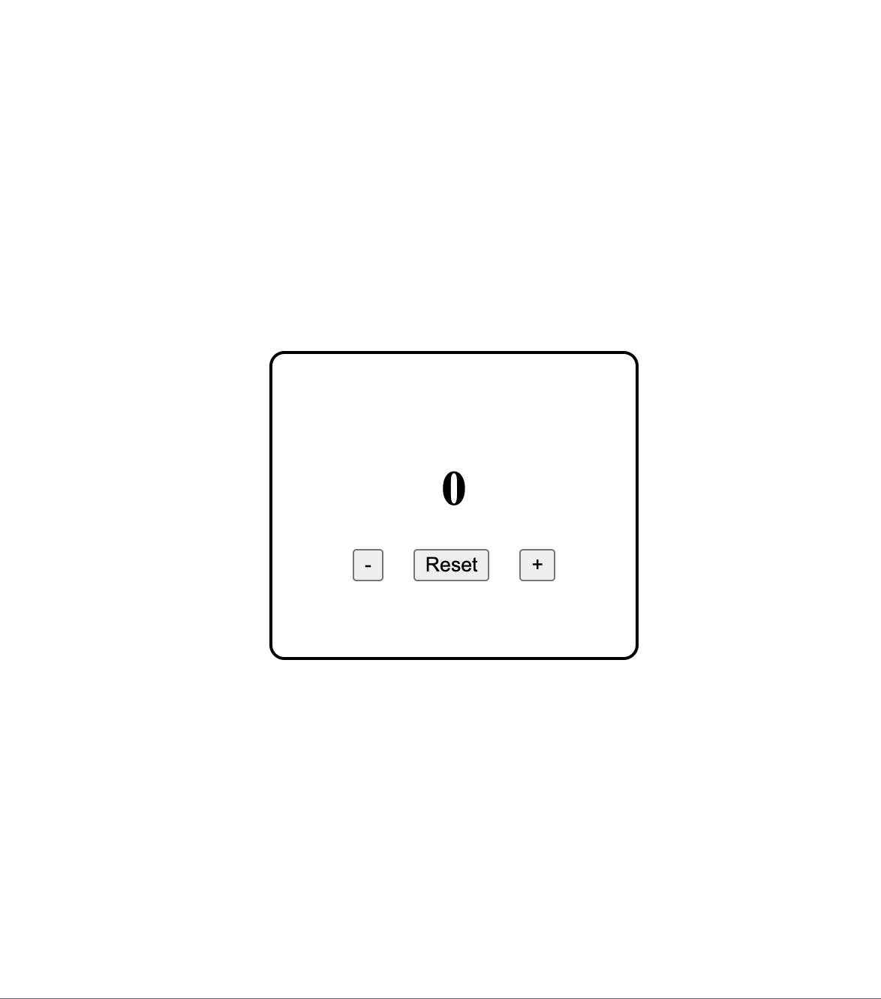

# Task 1 - Counter Application

## 📌 Overview

A simple Counter Application built using **HTML, CSS, and Vanilla JavaScript**.

This project was created to strengthen my understanding of:

- HTML structure
- CSS Flexbox
- DOM Manipulation
- Event Handling
- JavaScript Variables and State

---

## 🚀 Features

- Increment the counter
- Decrement the counter
- Reset the counter to 0
- Responsive centered card layout
- Clean and simple UI

---

## 🛠️ Technologies Used

- HTML5
- CSS3
- JavaScript (ES6)

---

## 📚 Concepts Practiced

### HTML

- Semantic HTML structure
- IDs and Classes
- Buttons
- Script linking

### CSS

- Flexbox
- Centering Elements
- Width & Height
- Border Radius
- Gap
- Responsive units (`vw`, `vh`)

### JavaScript

- DOM Selection (`getElementById`)
- Event Listeners (`addEventListener`)
- Arrow Functions
- Variables (`let`, `const`)
- Updating the DOM using `textContent`
- State Management

---

## 📂 Project Structure

```
counter-app/
│
├── index.html
├── style.css
├── script.js
└── README.md
```

---

## 🎯 Learning Outcome

Through this project, I learned:

- How HTML, CSS, and JavaScript work together.
- How Flexbox aligns child elements using a parent container.
- How to select DOM elements.
- How to listen for user events.
- How to update the UI dynamically.
- The difference between JavaScript state and the DOM.

---

## 📸 Preview

```
+---------------------------+
|                           |
|            0              |
|                           |
|    -    Reset    +        |
|                           |
+---------------------------+
```





## 👨‍💻 Author

Built as part of my Frontend JavaScript practice to strengthen DOM manipulation and UI development skills.